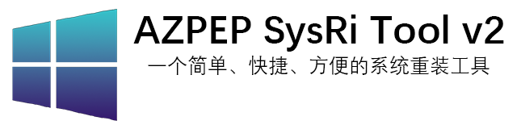


# AZPEP SysRi Tool v2

本仓库是“AZPEP SysRi Tool v2”的软件发布仓库，不存放“AZPEP SysRi Tool v2”的源代码，“AZPEP SysRi Tool v2”为闭源软件！

若想获取“AZPEP SysRi Tool 0.0.1.0 Beta”的源代码，请[点击这里跳转](https://gitee.com/AZPEP_BiliBili/astv1-source-code) \
若想获取“AZPEP SysRi Tool v2 Beta-0.1.0”的源代码，请[点击这里跳转](https://gitee.com/AZPEP_BiliBili/azpep-sys-ri-tool-beta-0.1.0-source-code)

当前版本： Beta 0.4.0

# 配置要求

## 最低配置
低于这个界限时，程序将不能正常运行，即使在这个界限以上，程序的工作也可能出现问题。

处理器：1 千兆赫 (GHz) 或更快的x64处理器或者 SoC \
内存：电脑总内存>=2GB \
固件：使用普通 Legacy BIOS 固件启动电脑 \
硬盘： \
&emsp;&emsp;下载位置需要有750MB左右的空闲空间，系统盘至少有1.5GB的空闲空间，若安装程序，则需安装位置至少750MB的空闲空间\
&emsp;&emsp;进行“重装系统”操作时，应保证系统盘至少有10GB的空闲空间和至少40GB的总空间 \
&emsp;&emsp;使用程序前，挂载的分区数应始终<=20 \
&emsp;&emsp;系统盘未启用加密，系统盘所在的硬盘未启用全盘加密 \
&emsp;&emsp;系统盘所在硬盘的主引导记录类型为MBR 

显卡：支持DirectX11 \
显示器：分辨率为1024x768及以上 \
操作系统：“Microsoft Windows 10 2004”及以上版本，使用“Legacy+MBR”的方式启动

## 标准配置

程序可在如下配置的电脑中正常运行，但可能产生系统卡顿。

处理器：1 千兆赫 (GHz) 或更快的x64处理器或者 SoC \
内存：电脑总内存>=4GB \
固件：使用UEFI固件启动，且固件支持“UEFI 2.3.1”及以上协议 \
硬盘： \
&emsp;&emsp;下载位置需要有1GB左右的空闲空间，系统盘至少有2GB的空闲空间，若安装程序，则需安装位置至少1GB的空闲空间\
&emsp;&emsp;进行“重装系统”操作时，应保证系统盘至少有15GB的空闲空间和至少50GB的总空间 \
&emsp;&emsp;使用程序前，挂载的分区数应始终<=18 \
&emsp;&emsp;系统盘未启用加密，系统盘所在的硬盘未启用全盘加密，且系统盘中无重要数据 \
&emsp;&emsp;系统盘所在硬盘的主引导记录类型为GPT 

显卡：支持DirectX11 \
显示器：分辨率为1366x768及以上 \
操作系统：“Microsoft Windows 10 20H2”及以上版本，使用“UEFI+GPT”的方式启动

## 推荐配置

程序可在如下配置的电脑中流畅运行

处理器：2 千兆赫 (GHz) 或更快的64位处理器或者 SoC \
内存：电脑总内存>=6GB \
固件：使用UEFI固件启动，且固件支持“UEFI 2.3.1”及以上协议，支持安全启动 \
硬盘：\
&emsp;&emsp;下载位置需要有2GB的空闲空间，系统盘至少有3GB的空闲空间，若安装程序则需安装位置至少2GB的空闲空间\
&emsp;&emsp;进行“重装系统”操作时，应保证系统分区至少有30GB的空闲空间和至少100GB的总空间 \
&emsp;&emsp;使用程序前，挂载的分区数应始终<=10 \
&emsp;&emsp;系统盘未启用加密，系统盘所在的硬盘未启用全盘加密，且系统盘中无重要数据 \
&emsp;&emsp;系统盘为所在硬盘类型为SSD，其主引导记录类型为GPT\
&emsp;&emsp;电脑中至少存在一个可引导的EFI分区和至少一个可用于存放数据的逻辑分区 \
显卡：支持DirectX11 \
显示器：分辨率为1920x1080及以上 \
操作系统：“Microsoft Windows 11 22H2”及以上版本，使用“UEFI+GPT”的方式启动

## 不能运行的配置
若电脑配置满足下面配置中的任何一条，则程序不会正确地工作。未特殊说明时，下述的大部分情况会使程序会在初始化阶段直接报错并立即终止运行： \
&emsp;&emsp;打开安装程序时，系统盘的空闲空间不足500MB \
&emsp;&emsp;安装程序时，安装位置的空闲空间不足500MB \
&emsp;&emsp;仅使用一次程序时，系统盘的空闲空间不足1200MB

&emsp;&emsp;显卡不支持DirectX11 \
&emsp;&emsp;显示器分辨率不足1024x768

&emsp;&emsp;电脑采用“UEFI+MBR”或者“Legacy+GPT”引导 \
&emsp;&emsp;电脑采用“UEFI+GPT”引导时，当前操作系统的EFI分区与系统盘处于同一个分区中 \
&emsp;&emsp;电脑系统盘启用了加密，或者系统盘所在的硬盘启用了全盘加密

&emsp;&emsp;执行“重装系统”时，系统盘的空闲空间过少（空闲空间<=映像大小+500MB），或者系统盘的总空间过少，不满足映像内操作系统对硬盘的最低要求 \
&emsp;&emsp;执行“重装系统”时且电脑采用“UEFI+GPT”引导时，EFI分区启动写保护

# 鸣谢
感谢以下网友的鼓励，使我在受挫时重新开始该项目： \
[@Windows11娘](https://space.bilibili.com/414666753) \
[@VirtualHotBar](https://space.bilibili.com/443230923) \
[@记住你的名字_](https://space.bilibili.com/1601172780) \
[@FoksfD](https://space.bilibili.com/1211966604) 

# 开发者链接
B站：[零分的考卷](https://space.bilibili.com/257391258) \
Github：[AZPEP-BiliBili](https://github.com/AZPEP-BiliBili) \
Gitee：[AZPEP_BiliBili](https://gitee.com/AZPEP_BiliBili)